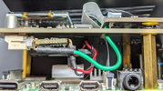

# PiKVM-PWM-Fan - Adding PWM fan control to the Geekworm PiKVM-A3 kit

TODO:
* add OLED mods/images, with reference oled_fan_pwm branch of kvmd fork
* add a schematic?
* document adding --verbose or --debug arguments to kvmd-fan invocation
* document adding wiringPi debug options WIRINGPI_DEBUG=1

The Geekworm [PiKVM-A3](https://geekworm.com/products/pikvm-a3) kit includes a 30mm fan integrated into the X630-A3 Hat. The fan is hard-wired to 5V, and runs continuosly at full speed. It's not too noisy, but it's not too quiet either - certainly in my quite office space. I looked for true PWM controlled 30mm fan, but was unsuccessful, so I set out to convert it to a PWM controlled fan that would track the CPU temperature and spin accordingly.

The results were very satisfactory. This modification is probably applicable to most any PiKVM clone with a fan, or perhaps even the branded PiKVM devices. I don't have any, so I can't say for sure.

The PiKVM-A3 uses a RPi-4b mainboard, and this modification is specific to that board, but could be tweaked to work with other RPi boards.

### Hardware Mods

The 30mm fan that comes with the kit is a 2-wire fan, so implementing PWM control is not as simple as connecting it to the RPi PWM control interface. The fan sinks more current than is safely available from the RPi GPIO drivers, and requires 5V instead of the GPIO 3.3V output. An intermediary component is required to provide the necessary voltage and current.

I settled on the [EZ Fan2](https://www.tindie.com/products/jeremycook/ez-fan2-tiny-raspberry-pi-fan-controller), though there are probably more to choose from. This device is very small, and is easy to tuck into the tight space within the enclosure.

1. Re-wire the fan to go through the controller

   I cut and modified the cable connecting the fan to the Hat, and wired in the fan controller between them.  You can tuck it all in right next to the fan on the hat.

   [](images/PWM_wires_1.png)   [](images/PWM_wires_2.png)


2. Wire the GPIO pin of the fan controller to GPIO 12 of the RPi.

   I used a 100 ohm resistor in series to limit the current draw from the RPi GPIO pin, but that's not totally necessary unless you plan on using other GPIO pins on your PiKVM (there is a limit to the total current available to GPIO pins).

   [](images/GPIO_wire.png)   [](images/GPIO_resistor.png)

3. Modify */boot/config.txt* to enable PWM

    With the 4b, you only have two choices as to which set of PWM outputs to use; GPIO **12&13** or GPIO **18&19** (*pins 32&33, pins 12&35*). For the Geekworm PiKVM hat, GPIO 18 is already used (for audio I belive), so that leaves only 12&13.
   
   I chose pin **12** (*pin #32 PWM0*), as that's the default for kvmd-fan. Don't confuse GPIO numbers with pin numbers.  [RPi-4 pinout](https://www.electrorules.com/raspberry-pi-4-gpio-pnout)
   ```
    # PWM on GPIO-12
    dtoverlay=pwm-2chan,pin=12,func=4,pin2=13,func2=4
   ```
4. Get/modify a version of kvmd-fan to "*do the right thing*".
   
   The stock version of *kvmd-fan* runs the PWM signal in *balanced* mode, and a high (> 9MHz) signal on the PWM output pin. This results in a lot of acoustic noise due to the constant acceleration/deceleration (for the two fans I tried).
   
   I made changes to set the frequency to *~25KHz* (industry standard for small fans), and enable *mark-space* mode which produces a uniform square-wave. My modified version is available here on github - [https://github.com/agspoon/kvmd-fan](https://github.com/agspoon/kvmd-fan/tree/pwm_mode). Note, you want the *pwm_mode_freq* branch in the repo.

5. Configure kvmd-fan with the following content in /etc/conf.d/kvmd-fan (tweak as needed for your environment, and ears).
  
   You will need to establish the lowest speed at which the fan will still spin reliably (*--speed-idle*).
   ```
    KVMD_FAN_ARGS=" --speed-idle=40 --speed-low=50 --speed-high=90 --temp-low=30 --temp-high=60"
   ```
6. Enable the kvmd-fan service at boot, and start it,
   ```
    systemctl enable kvmd-fan.service
    systemctl start kvmd-fan.service
   ```
My A3 based PiKVM now sits next to me, and is nearly silent.  It will spin up if it has to work hard, but almost never runs at full speed.  I even went as far as modifying the kvmd-oled utility to add the current PWM duty cycle to the display (*see below*).

### Software Mods

As for the kvmd-oled mod, it's pretty much a hack.  The kvmd-fan process creates a UNIX socket at "/run/kvmd/fan.sock".  This is used by the main kvmd process to read and publish values like temperature, fan speed, fan PWM, etc.  You can see this in the UI under "System->about->hardware".

You can also read the socket with this curl command,
```
 curl -s --unix-socket /run/kvmd/fan.sock http://localhost/state
```

### Debugging

First steps are to make sure that the PWM controller is working correctly.  If you connect the PWM *signal* wire that would normally go to GPIO 12 to **GND** (or leave floating) the fan should stop.  If connected to **3.3v** (*pin 1*) it should spin at full speed.

If that's working, then you can try manually controlling the PWM signal.  Connect the controller to GPIO 12, and stop the kvmd-fan service (systemctl stop kvmd-fan).  Then use the sysfs interface to change the signal as follows, [pwm.txt](https://www.kernel.org/doc/Documentation/pwm.txt)

    [root@pikvm ~]# cd /sys/class/pwm/pwmchip0

    [root@pikvm pwmchip0]# ls -l
    total 0
    lrwxrwxrwx 1 root root    0 Jan 28 07:39 device -> ../../../fe20c000.pwm
    drwxr-xr-x 2 root root    0 Jan 28 07:39 power
    lrwxrwxrwx 1 root root    0 Jan 28 07:39 subsystem -> ../../../../../../class/pwm
    --w------- 1 root root 4096 Jan 28 07:39 export
    -r--r--r-- 1 root root 4096 Jan 28 07:39 npwm
    -rw-r--r-- 1 root root 4096 Jan 28 07:39 uevent
    --w------- 1 root root 4096 Jan 28 07:39 unexport

    [root@pikvm pwmchip0]# echo 0 > export 

    [root@pikvm pwmchip0]# ls -l
    total 0
    lrwxrwxrwx 1 root root    0 Jan 28 07:39 device -> ../../../fe20c000.pwm
    drwxr-xr-x 2 root root    0 Jan 28 07:39 power
    drwxr-xr-x 3 root root    0 Jan 28 07:40 pwm0
    lrwxrwxrwx 1 root root    0 Jan 28 07:39 subsystem -> ../../../../../../class/pwm
    --w------- 1 root root 4096 Jan 28 07:40 export
    -r--r--r-- 1 root root 4096 Jan 28 07:39 npwm
    -rw-r--r-- 1 root root 4096 Jan 28 07:39 uevent
    --w------- 1 root root 4096 Jan 28 07:39 unexport

    [root@pikvm pwmchip0]# cd pwm0

    [root@pikvm pwm0]# ls -l
    total 0
    drwxr-xr-x 2 root root    0 Jan 28 07:40 power
    -r--r--r-- 1 root root 4096 Jan 28 07:40 capture
    -rw-r--r-- 1 root root 4096 Jan 28 07:40 duty_cycle
    -rw-r--r-- 1 root root 4096 Jan 28 07:40 enable
    -rw-r--r-- 1 root root 4096 Jan 28 07:40 period
    -rw-r--r-- 1 root root 4096 Jan 28 07:40 polarity
    -rw-r--r-- 1 root root 4096 Jan 28 07:40 uevent

    [root@pikvm pwm0]# echo 40000 > period         (this is 25KHz)
    
    [root@pikvm pwm0]# echo 1 > enable             (start the signal)
    
    [root@pikvm pwm0]# echo 40000 > duty_cycle     (100% duty cycle)
    [root@pikvm pwm0]# echo 20000 > duty_cycle     (50% duty cycle)
    [root@pikvm pwm0]# echo 0 > duty_cycle         (stop)

    [root@pikvm pwm0]# echo 15000 > duty_cycle     (minimum my fan will spin)
    
    [root@pikvm pwm0]# echo 0 > enable             (stop the signal)
    
    [root@pikvm pwm0]# cd ..
    [root@pikvm pwm0]# echo 0 > unexport           (removes pwm0)

If everything above works as expected, then my modified kvmd-fan service should control things as expected.

